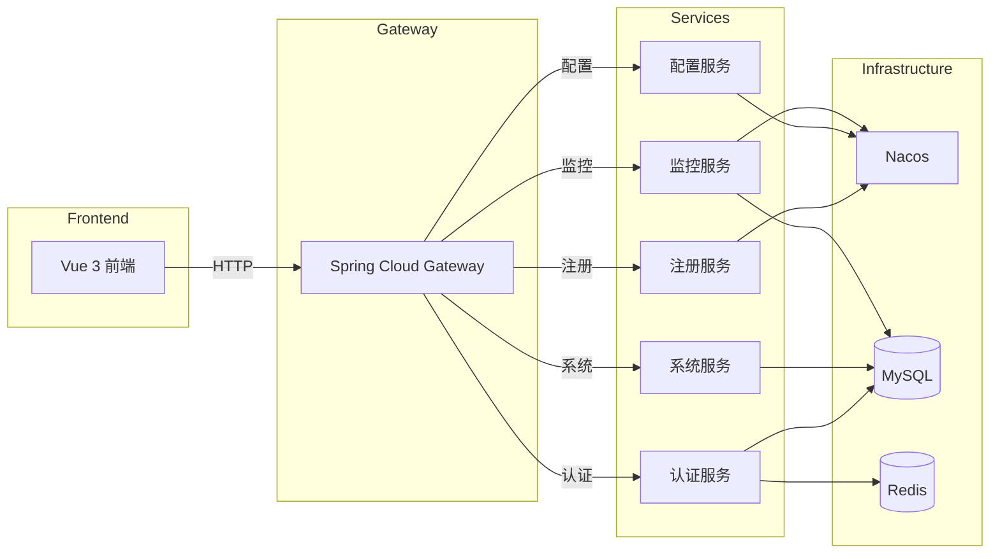

# 架构设计文档 - Cloud Govern

> 版本: 1.0 | 创建日期: 2026-02-13

---

## 一、系统架构概览

### 1.1 整体架构图

```
┌─────────────────────────────────────────────────────────────────────────────┐
│                              Cloud Govern 架构图                              │
├─────────────────────────────────────────────────────────────────────────────┤
│                                                                             │
│  ┌─────────────────────────────────────────────────────────────────────┐   │
│  │                           用户层                                     │   │
│  │                    浏览器 (Chrome/Firefox/Safari)                    │   │
│  └─────────────────────────────────────────────────────────────────────┘   │
│                                    │                                        │
│                                    │ HTTPS                                 │
│                                    ▼                                        │
│  ┌─────────────────────────────────────────────────────────────────────┐   │
│  │                          前端层 (Vue 3)                              │   │
│  │  ┌─────────┐  ┌─────────┐  ┌─────────┐  ┌─────────┐  ┌─────────┐   │   │
│  │  │  登录   │  │ 服务管理 │  │ 配置管理 │  │ 监控面板 │  │ 系统管理 │   │   │
│  │  └─────────┘  └─────────┘  └─────────┘  └─────────┘  └─────────┘   │   │
│  │                                                                     │   │
│  │  TDesign + Pinia + Vue Router + Axios + TypeScript                 │   │
│  └─────────────────────────────────────────────────────────────────────┘   │
│                                    │                                        │
│                                    │ HTTP/REST API                         │
│                                    ▼                                        │
│  ┌─────────────────────────────────────────────────────────────────────┐   │
│  │                        网关层 (Gateway)                              │   │
│  │                                                                     │   │
│  │   Spring Cloud Gateway                                              │   │
│  │   ├── 路由转发                                                       │   │
│  │   ├── 负载均衡                                                       │   │
│  │   ├── 认证鉴权 (Sa-Token)                                            │   │
│  │   ├── 限流熔断 (Sentinel)                                            │   │
│  │   └── 跨域处理                                                       │   │
│  └─────────────────────────────────────────────────────────────────────┘   │
│                                    │                                        │
│          ┌─────────────────────────┼─────────────────────────┐             │
│          │                         │                         │             │
│          ▼                         ▼                         ▼             │
│  ┌─────────────┐          ┌─────────────┐          ┌─────────────┐        │
│  │   Auth      │          │   System    │          │  Registry   │        │
│  │   认证服务   │          │   系统服务   │          │  注册服务    │        │
│  └─────────────┘          └─────────────┘          └─────────────┘        │
│          │                         │                         │             │
│          │              ┌─────────────┐          ┌─────────────┐          │
│          │              │   Config    │          │   Monitor   │          │
│          │              │   配置服务   │          │   监控服务   │          │
│          │              └─────────────┘          └─────────────┘          │
│          │                         │                         │             │
│          └─────────────────────────┼─────────────────────────┘             │
│                                    │                                        │
│                                    ▼                                        │
│  ┌─────────────────────────────────────────────────────────────────────┐   │
│  │                        服务治理层 (Nacos)                            │   │
│  │                                                                     │   │
│  │   ┌─────────────────┐              ┌─────────────────┐              │   │
│  │   │  Nacos Server   │              │  Sentinel       │              │   │
│  │   │  服务注册中心    │              │  流量控制        │              │   │
│  │   │  配置中心        │              │  熔断降级        │              │   │
│  │   └─────────────────┘              └─────────────────┘              │   │
│  └─────────────────────────────────────────────────────────────────────┘   │
│                                    │                                        │
│                                    ▼                                        │
│  ┌─────────────────────────────────────────────────────────────────────┐   │
│  │                        数据层 (Storage)                              │   │
│  │                                                                     │   │
│  │   ┌─────────────────┐              ┌─────────────────┐              │   │
│  │   │     MySQL       │              │     Redis       │              │   │
│  │   │   业务数据存储    │              │  缓存/Session   │              │   │
│  │   └─────────────────┘              └─────────────────┘              │   │
│  └─────────────────────────────────────────────────────────────────────┘   │
│                                                                             │
│  ┌─────────────────────────────────────────────────────────────────────┐   │
│  │                      基础设施层 (Infrastructure)                     │   │
│  │                                                                     │   │
│  │   Docker + Docker Compose + (可选: Kubernetes)                      │   │
│  └─────────────────────────────────────────────────────────────────────┘   │
│                                                                             │
└─────────────────────────────────────────────────────────────────────────────┘
```

### 1.2 服务调用关系



---

## 二、模块划分

### 2.1 后端模块结构

```
cloud-govern/
├── cloud-govern-common/           # 公共模块
│   ├── src/main/java/
│   │   └── com/cloud/govern/common/
│   │       ├── constant/          # 常量定义
│   │       ├── enums/             # 枚举类
│   │       ├── exception/         # 异常定义
│   │       ├── result/            # 统一响应
│   │       ├── utils/             # 工具类
│   │       └── entity/            # 基础实体
│   └── pom.xml
│
├── cloud-govern-gateway/          # API 网关
│   ├── src/main/java/
│   │   └── com/cloud/govern/gateway/
│   │       ├── config/            # 网关配置
│   │       ├── filter/            # 全局过滤器
│   │       │   ├── AuthFilter     # 认证过滤器
│   │       │   ├── LogFilter      # 日志过滤器
│   │       │   └── CorsFilter     # 跨域过滤器
│   │       └── handler/           # 异常处理
│   └── pom.xml
│
├── cloud-govern-auth/             # 认证授权服务
│   ├── src/main/java/
│   │   └── com/cloud/govern/auth/
│   │       ├── controller/        # 控制器
│   │       ├── service/           # 业务逻辑
│   │       ├── mapper/            # 数据访问
│   │       └── entity/            # 实体类
│   └── pom.xml
│
├── cloud-govern-system/           # 系统管理服务
│   ├── src/main/java/
│   │   └── com/cloud/govern/system/
│   │       ├── controller/
│   │       │   ├── UserController
│   │       │   ├── RoleController
│   │       │   └── MenuController
│   │       ├── service/
│   │       ├── mapper/
│   │       └── entity/
│   └── pom.xml
│
├── cloud-govern-registry/         # 服务注册管理
│   ├── src/main/java/
│   │   └── com/cloud/govern/registry/
│   │       ├── client/            # Nacos API 客户端
│   │       ├── controller/
│   │       ├── service/
│   │       └── dto/
│   └── pom.xml
│
├── cloud-govern-config/           # 配置中心管理
│   ├── src/main/java/
│   │   └── com/cloud/govern/config/
│   │       ├── client/            # Nacos Config 客户端
│   │       ├── controller/
│   │       ├── service/
│   │       └── dto/
│   └── pom.xml
│
├── cloud-govern-monitor/          # 服务监控
│   ├── src/main/java/
│   │   └── com/cloud/govern/monitor/
│   │       ├── collector/         # 指标采集
│   │       ├── controller/
│   │       ├── service/
│   │       └── alert/             # 告警模块
│   └── pom.xml
│
├── cloud-govern-ui/               # 前端项目
│   ├── src/
│   │   ├── api/                   # API 接口
│   │   ├── components/            # 公共组件
│   │   ├── layouts/               # 布局组件
│   │   ├── pages/                 # 页面
│   │   ├── router/                # 路由配置
│   │   ├── store/                 # 状态管理
│   │   ├── styles/                # 样式文件
│   │   ├── utils/                 # 工具函数
│   │   └── App.vue
│   ├── package.json
│   └── vite.config.ts
│
├── docker/                        # Docker 配置
│   ├── docker-compose.yml
│   └── mysql/init.sql
│
├── docs/                          # 文档
│   ├── api.md
│   ├── deployment.md
│   └── development.md
│
├── pom.xml                        # 父 POM
└── README.md
```

### 2.2 前端模块结构

```
cloud-govern-ui/
├── public/
│   └── favicon.ico
│
├── src/
│   ├── api/                       # API 接口定义
│   │   ├── auth.ts                # 认证接口
│   │   ├── user.ts                # 用户接口
│   │   ├── role.ts                # 角色接口
│   │   ├── menu.ts                # 菜单接口
│   │   ├── service.ts             # 服务注册接口
│   │   ├── config.ts              # 配置中心接口
│   │   └── monitor.ts             # 监控接口
│   │
│   ├── components/                # 公共组件
│   │   ├── common/
│   │   │   ├── Breadcrumb.vue     # 面包屑
│   │   │   ├── Pagination.vue     # 分页
│   │   │   └── SearchForm.vue     # 搜索表单
│   │   └── business/
│   │       ├── ServiceCard.vue    # 服务卡片
│   │       ├── ConfigEditor.vue   # 配置编辑器
│   │       └── MetricChart.vue    # 指标图表
│   │
│   ├── layouts/                   # 布局组件
│   │   ├── default.vue            # 默认布局（带侧边栏）
│   │   └── blank.vue              # 空白布局（登录页）
│   │
│   ├── pages/                     # 页面组件
│   │   ├── login/                 # 登录页
│   │   │   └── index.vue
│   │   ├── dashboard/             # 首页仪表盘
│   │   │   └── index.vue
│   │   ├── service/               # 服务管理
│   │   │   ├── list.vue           # 服务列表
│   │   │   └── detail.vue         # 服务详情
│   │   ├── config/                # 配置管理
│   │   │   ├── namespace.vue      # 命名空间
│   │   │   ├── list.vue           # 配置列表
│   │   │   └── edit.vue           # 配置编辑
│   │   ├── monitor/               # 服务监控
│   │   │   └── index.vue
│   │   ├── gateway/               # 网关管理
│   │   │   ├── route.vue          # 路由管理
│   │   │   └── rule.vue           # 限流规则
│   │   └── system/                # 系统管理
│   │       ├── user/              # 用户管理
│   │       ├── role/              # 角色管理
│   │       └── menu/              # 菜单管理
│   │
│   ├── router/                    # 路由配置
│   │   ├── index.ts               # 路由入口
│   │   └── routes.ts              # 路由定义
│   │
│   ├── store/                     # 状态管理 (Pinia)
│   │   ├── index.ts
│   │   ├── user.ts                # 用户状态
│   │   ├── menu.ts                # 菜单状态
│   │   └── app.ts                 # 应用状态
│   │
│   ├── styles/                    # 样式文件
│   │   ├── index.less             # 入口样式
│   │   ├── variables.less         # 变量定义
│   │   └── reset.less             # 重置样式
│   │
│   ├── utils/                     # 工具函数
│   │   ├── request.ts             # Axios 封装
│   │   ├── auth.ts                # Token 管理
│   │   ├── permission.ts          # 权限判断
│   │   └── format.ts              # 格式化工具
│   │
│   ├── App.vue                    # 根组件
│   └── main.ts                    # 入口文件
│
├── .env                           # 环境变量
├── .env.development               # 开发环境
├── .env.production                # 生产环境
├── .eslintrc.js                   # ESLint 配置
├── .prettierrc                    # Prettier 配置
├── index.html                     # HTML 模板
├── package.json
├── tsconfig.json                  # TypeScript 配置
└── vite.config.ts                 # Vite 配置
```

---

## 三、数据库设计

### 3.1 ER 图

```
┌─────────────────────────────────────────────────────────────────────────────┐
│                              数据库 ER 图                                    │
├─────────────────────────────────────────────────────────────────────────────┤
│                                                                             │
│  ┌─────────────┐         ┌─────────────┐         ┌─────────────┐           │
│  │    user     │         │    role     │         │    menu     │           │
│  ├─────────────┤         ├─────────────┤         ├─────────────┤           │
│  │ id (PK)     │         │ id (PK)     │         │ id (PK)     │           │
│  │ username    │         │ role_name   │         │ parent_id   │           │
│  │ password    │         │ role_key    │         │ menu_name   │           │
│  │ nickname    │         │ status      │         │ menu_type   │           │
│  │ email       │         │ sort        │         │ path        │           │
│  │ phone       │         │ create_time │         │ component   │           │
│  │ status      │         │ update_time │         │ perms       │           │
│  │ create_time │         └──────┬──────┘         │ icon        │           │
│  │ update_time │                │                │ sort        │           │
│  └──────┬──────┘                │                │ status      │           │
│         │                       │                │ create_time │           │
│         │                       │                │ update_time │           │
│         │                       │                └──────┬──────┘           │
│         │                       │                       │                  │
│         │  ┌────────────────────┴────────────────────┐ │                  │
│         │  │                                           │                  │
│         │  │  ┌─────────────┐         ┌─────────────┐ │                  │
│         │  │  │ user_role   │         │ role_menu   │ │                  │
│         │  │  ├─────────────┤         ├─────────────┤ │                  │
│         └──┼──│ user_id(FK) │         │ role_id(FK) │─┘                  │
│            │  │ role_id(FK) │         │ menu_id(FK) │                    │
│            │  └─────────────┘         └─────────────┘                    │
│            │                                                              │
│            │                                                              │
│  ┌─────────┴───────┐                                                     │
│  │   audit_log     │                                                     │
│  ├─────────────────┤                                                     │
│  │ id (PK)         │                                                     │
│  │ user_id (FK)    │                                                     │
│  │ operation       │                                                     │
│  │ method          │                                                     │
│  │ params          │                                                     │
│  │ ip              │                                                     │
│  │ create_time     │                                                     │
│  └─────────────────┘                                                     │
│                                                                           │
│  ┌─────────────────┐         ┌─────────────────┐                         │
│  │ gateway_route   │         │   alert_rule    │                         │
│  ├─────────────────┤         ├─────────────────┤                         │
│  │ id (PK)         │         │ id (PK)         │                         │
│  │ route_id        │         │ name            │                         │
│  │ route_name      │         │ service_name    │                         │
│  │ uri             │         │ metric_type     │                         │
│  │ predicates      │         │ condition       │                         │
│  │ filters         │         │ threshold       │                         │
│  │ metadata        │         │ notify_channels │                         │
│  │ status          │         │ status          │                         │
│  │ create_time     │         │ create_time     │                         │
│  │ update_time     │         │ update_time     │                         │
│  └─────────────────┘         └─────────────────┘                         │
│                                                                           │
└───────────────────────────────────────────────────────────────────────────┘
```

### 3.2 核心表结构

#### 用户表 (sys_user)

```sql
CREATE TABLE `sys_user` (
  `id` bigint NOT NULL AUTO_INCREMENT COMMENT '用户ID',
  `username` varchar(50) NOT NULL COMMENT '用户名',
  `password` varchar(100) NOT NULL COMMENT '密码',
  `nickname` varchar(50) DEFAULT NULL COMMENT '昵称',
  `email` varchar(100) DEFAULT NULL COMMENT '邮箱',
  `phone` varchar(20) DEFAULT NULL COMMENT '手机号',
  `avatar` varchar(255) DEFAULT NULL COMMENT '头像',
  `status` tinyint DEFAULT 1 COMMENT '状态：0禁用 1启用',
  `deleted` tinyint DEFAULT 0 COMMENT '删除标志：0未删除 1已删除',
  `create_time` datetime DEFAULT CURRENT_TIMESTAMP COMMENT '创建时间',
  `update_time` datetime DEFAULT CURRENT_TIMESTAMP ON UPDATE CURRENT_TIMESTAMP COMMENT '更新时间',
  PRIMARY KEY (`id`),
  UNIQUE KEY `uk_username` (`username`)
) ENGINE=InnoDB DEFAULT CHARSET=utf8mb4 COMMENT='用户表';
```

#### 角色表 (sys_role)

```sql
CREATE TABLE `sys_role` (
  `id` bigint NOT NULL AUTO_INCREMENT COMMENT '角色ID',
  `role_name` varchar(50) NOT NULL COMMENT '角色名称',
  `role_key` varchar(50) NOT NULL COMMENT '角色权限字符',
  `description` varchar(255) DEFAULT NULL COMMENT '描述',
  `status` tinyint DEFAULT 1 COMMENT '状态：0禁用 1启用',
  `deleted` tinyint DEFAULT 0 COMMENT '删除标志',
  `sort` int DEFAULT 0 COMMENT '排序',
  `create_time` datetime DEFAULT CURRENT_TIMESTAMP,
  `update_time` datetime DEFAULT CURRENT_TIMESTAMP ON UPDATE CURRENT_TIMESTAMP,
  PRIMARY KEY (`id`),
  UNIQUE KEY `uk_role_key` (`role_key`)
) ENGINE=InnoDB DEFAULT CHARSET=utf8mb4 COMMENT='角色表';
```

#### 菜单表 (sys_menu)

```sql
CREATE TABLE `sys_menu` (
  `id` bigint NOT NULL AUTO_INCREMENT COMMENT '菜单ID',
  `parent_id` bigint DEFAULT 0 COMMENT '父菜单ID',
  `menu_name` varchar(50) NOT NULL COMMENT '菜单名称',
  `menu_type` tinyint NOT NULL COMMENT '类型：1目录 2菜单 3按钮',
  `path` varchar(200) DEFAULT NULL COMMENT '路由路径',
  `component` varchar(200) DEFAULT NULL COMMENT '组件路径',
  `perms` varchar(100) DEFAULT NULL COMMENT '权限标识',
  `icon` varchar(100) DEFAULT NULL COMMENT '图标',
  `sort` int DEFAULT 0 COMMENT '排序',
  `visible` tinyint DEFAULT 1 COMMENT '是否可见',
  `status` tinyint DEFAULT 1 COMMENT '状态',
  `deleted` tinyint DEFAULT 0,
  `create_time` datetime DEFAULT CURRENT_TIMESTAMP,
  `update_time` datetime DEFAULT CURRENT_TIMESTAMP ON UPDATE CURRENT_TIMESTAMP,
  PRIMARY KEY (`id`)
) ENGINE=InnoDB DEFAULT CHARSET=utf8mb4 COMMENT='菜单权限表';
```

#### 用户角色关联表 (sys_user_role)

```sql
CREATE TABLE `sys_user_role` (
  `user_id` bigint NOT NULL COMMENT '用户ID',
  `role_id` bigint NOT NULL COMMENT '角色ID',
  PRIMARY KEY (`user_id`, `role_id`)
) ENGINE=InnoDB DEFAULT CHARSET=utf8mb4 COMMENT='用户角色关联表';
```

#### 角色菜单关联表 (sys_role_menu)

```sql
CREATE TABLE `sys_role_menu` (
  `role_id` bigint NOT NULL COMMENT '角色ID',
  `menu_id` bigint NOT NULL COMMENT '菜单ID',
  PRIMARY KEY (`role_id`, `menu_id`)
) ENGINE=InnoDB DEFAULT CHARSET=utf8mb4 COMMENT='角色菜单关联表';
```

#### 审计日志表 (sys_audit_log)

```sql
CREATE TABLE `sys_audit_log` (
  `id` bigint NOT NULL AUTO_INCREMENT,
  `user_id` bigint DEFAULT NULL COMMENT '操作用户ID',
  `username` varchar(50) DEFAULT NULL COMMENT '操作用户名',
  `operation` varchar(100) DEFAULT NULL COMMENT '操作描述',
  `method` varchar(200) DEFAULT NULL COMMENT '请求方法',
  `params` text COMMENT '请求参数',
  `ip` varchar(50) DEFAULT NULL COMMENT 'IP地址',
  `result` text COMMENT '操作结果',
  `status` tinyint DEFAULT 1 COMMENT '操作状态：1成功 0失败',
  `error_msg` text COMMENT '错误信息',
  `duration` bigint DEFAULT NULL COMMENT '执行时长(ms)',
  `create_time` datetime DEFAULT CURRENT_TIMESTAMP,
  PRIMARY KEY (`id`),
  KEY `idx_user_id` (`user_id`),
  KEY `idx_create_time` (`create_time`)
) ENGINE=InnoDB DEFAULT CHARSET=utf8mb4 COMMENT='审计日志表';
```

#### 网关路由表 (gateway_route)

```sql
CREATE TABLE `gateway_route` (
  `id` bigint NOT NULL AUTO_INCREMENT,
  `route_id` varchar(50) NOT NULL COMMENT '路由ID',
  `route_name` varchar(100) DEFAULT NULL COMMENT '路由名称',
  `uri` varchar(200) NOT NULL COMMENT '目标URI',
  `predicates` text COMMENT '断言配置(JSON)',
  `filters` text COMMENT '过滤器配置(JSON)',
  `metadata` text COMMENT '元数据(JSON)',
  `order` int DEFAULT 0 COMMENT '排序',
  `status` tinyint DEFAULT 1 COMMENT '状态',
  `create_time` datetime DEFAULT CURRENT_TIMESTAMP,
  `update_time` datetime DEFAULT CURRENT_TIMESTAMP ON UPDATE CURRENT_TIMESTAMP,
  PRIMARY KEY (`id`),
  UNIQUE KEY `uk_route_id` (`route_id`)
) ENGINE=InnoDB DEFAULT CHARSET=utf8mb4 COMMENT='网关路由表';
```

#### 告警规则表 (alert_rule)

```sql
CREATE TABLE `alert_rule` (
  `id` bigint NOT NULL AUTO_INCREMENT,
  `name` varchar(100) NOT NULL COMMENT '规则名称',
  `service_name` varchar(100) DEFAULT NULL COMMENT '服务名称',
  `metric_type` varchar(50) NOT NULL COMMENT '指标类型',
  `condition` varchar(20) NOT NULL COMMENT '条件：gt/lt/eq',
  `threshold` decimal(10,2) NOT NULL COMMENT '阈值',
  `duration` int DEFAULT 60 COMMENT '持续时间(秒)',
  `notify_channels` varchar(255) DEFAULT NULL COMMENT '通知渠道(JSON)',
  `status` tinyint DEFAULT 1,
  `create_time` datetime DEFAULT CURRENT_TIMESTAMP,
  `update_time` datetime DEFAULT CURRENT_TIMESTAMP ON UPDATE CURRENT_TIMESTAMP,
  PRIMARY KEY (`id`)
) ENGINE=InnoDB DEFAULT CHARSET=utf8mb4 COMMENT='告警规则表';
```

---

## 四、接口设计规范

### 4.1 RESTful API 规范

| 操作 | HTTP 方法 | URL 示例 | 说明 |
|------|-----------|----------|------|
| 查询列表 | GET | /api/v1/users | 分页查询 |
| 查询详情 | GET | /api/v1/users/{id} | 单条查询 |
| 新增 | POST | /api/v1/users | 创建资源 |
| 修改 | PUT | /api/v1/users/{id} | 全量更新 |
| 修改 | PATCH | /api/v1/users/{id} | 部分更新 |
| 删除 | DELETE | /api/v1/users/{id} | 删除资源 |

### 4.2 统一响应格式

```json
{
  "code": 200,
  "message": "操作成功",
  "data": {},
  "timestamp": 1707811200000
}
```

### 4.3 分页响应格式

```json
{
  "code": 200,
  "message": "操作成功",
  "data": {
    "list": [],
    "total": 100,
    "pageNum": 1,
    "pageSize": 10
  },
  "timestamp": 1707811200000
}
```

### 4.4 错误码规范

| 错误码 | 说明 |
|--------|------|
| 200 | 成功 |
| 400 | 参数错误 |
| 401 | 未授权 |
| 403 | 无权限 |
| 404 | 资源不存在 |
| 500 | 服务器错误 |

---

## 五、安全设计

### 5.1 认证流程

```
┌─────────┐                    ┌─────────┐                    ┌─────────┐
│  前端   │                    │  网关   │                    │ 认证服务 │
└────┬────┘                    └────┬────┘                    └────┬────┘
     │                              │                              │
     │  1. 登录请求                  │                              │
     │─────────────────────────────>│                              │
     │                              │  2. 转发到认证服务             │
     │                              │─────────────────────────────>│
     │                              │                              │
     │                              │  3. 验证用户名密码             │
     │                              │<─────────────────────────────│
     │                              │  4. 返回 JWT Token            │
     │                              │                              │
     │  5. 返回 Token               │                              │
     │<─────────────────────────────│                              │
     │                              │                              │
     │  6. 携带 Token 请求           │                              │
     │─────────────────────────────>│                              │
     │                              │  7. 验证 Token                │
     │                              │  8. 解析用户信息              │
     │                              │  9. 转发请求                  │
     │                              │─────────────────────────────>│
     │                              │                              │
```

### 5.2 权限控制

- **菜单权限**：根据用户角色动态加载菜单
- **按钮权限**：使用权限标识控制按钮显示
- **接口权限**：网关层进行权限校验

---

## 六、部署架构

### 6.1 Docker Compose 部署

```yaml
version: '3.8'

services:
  # MySQL
  mysql:
    image: mysql:8.0
    container_name: cloud-govern-mysql
    environment:
      MYSQL_ROOT_PASSWORD: root123
      MYSQL_DATABASE: cloud_govern
    ports:
      - "3306:3306"
    volumes:
      - mysql_data:/var/lib/mysql
      - ./mysql/init.sql:/docker-entrypoint-initdb.d/init.sql

  # Redis
  redis:
    image: redis:7.0
    container_name: cloud-govern-redis
    ports:
      - "6379:6379"
    volumes:
      - redis_data:/data

  # Nacos
  nacos:
    image: nacos/nacos-server:v2.3.0
    container_name: cloud-govern-nacos
    environment:
      MODE: standalone
      SPRING_DATASOURCE_PLATFORM: mysql
      MYSQL_SERVICE_HOST: mysql
      MYSQL_SERVICE_PORT: 3306
      MYSQL_SERVICE_DB_NAME: nacos
      MYSQL_SERVICE_USER: root
      MYSQL_SERVICE_PASSWORD: root123
    ports:
      - "8848:8848"
    depends_on:
      - mysql

  # Gateway
  gateway:
    build: ./cloud-govern-gateway
    container_name: cloud-govern-gateway
    ports:
      - "8080:8080"
    depends_on:
      - nacos
      - redis

  # Frontend
  frontend:
    build: ./cloud-govern-ui
    container_name: cloud-govern-ui
    ports:
      - "80:80"
    depends_on:
      - gateway

volumes:
  mysql_data:
  redis_data:
```

---

## 七、技术难点与解决方案

### 7.1 Nacos API 兼容性

**问题**：Nacos 版本升级可能导致 API 变更

**解决方案**：
- 封装 Nacos API 客户端层
- 使用适配器模式隔离 API 变化
- 支持 API 版本配置

### 7.2 配置编辑器

**问题**：需要支持多格式（YAML、JSON、Properties）的语法高亮

**解决方案**：
- 使用 Monaco Editor
- 根据文件扩展名切换语言模式
- 提供格式化功能

### 7.3 动态路由刷新

**问题**：修改路由规则后需要动态生效

**解决方案**：
- 路由配置存储在数据库
- 通过 Nacos 配置中心推送变更
- 网关监听配置变更事件

---

**文档维护者**: AI Assistant
**最后更新**: 2026-02-13
